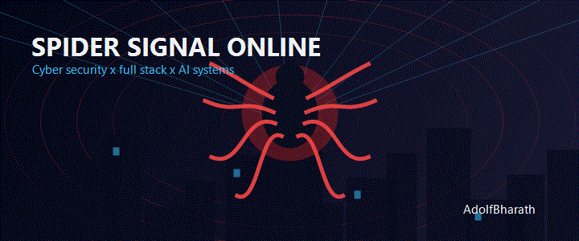

<!--
  GitHub Profile README for Bharath Murugan / AdolfBharath
  Theme: spider-inspired cyberpunk security portfolio.
  Note: this README avoids copied copyrighted artwork and uses generated SVG services,
  badges, profile widgets, and GitHub-safe HTML/Markdown.
-->

<div align="center">


<a href="https://git.io/typing-svg">
  
</a>

<br />
<br />



<br />
<br />


<br />
<br />

<table>
  <tr>
    <td align="center" width="33%">
      
      <br />
      <strong>Bharath Murugan</strong>
      <br />
      <sub>Cyber Security Engineering Student</sub>
    </td>
    <td align="center" width="34%">
      
      <br />
      <br />
      <strong>Spider-inspired systems thinker</strong>
      <br />
      <sub>Security, full stack products, AI workflows, and clean UX.</sub>
    </td>
    <td align="center" width="33%">
      
      <br />
      <br />
      <strong>Software Development Intern</strong>
      <br />
      <sub>LMS, dashboards, authentication, APIs, Supabase.</sub>
    </td>
  </tr>
</table>

<br />


</div>

## 

<table>
  <tr>
    <td width="42%" align="center" valign="middle">
      
      <br />
      <br />
      <strong>Bharath Murugan</strong>
      <br />
      <sub>@AdolfBharath</sub>
      <br />
      <br />
      
      <br />
      
      <br />
      
    </td>
    <td width="58%" valign="top">
      <h3>Mission Console</h3>
      <p>
        I build secure, useful, and visually sharp software across full stack products,
        AI-powered applications, dashboards, authentication systems, and cyber security labs.
      </p>
      <table>
        <tr>
          <td align="center"><strong>Secure APIs</strong><br /><sub>Auth, roles, clean data flow</sub></td>
          <td align="center"><strong>AI Apps</strong><br /><sub>Gemini, automation, recommendations</sub></td>
          <td align="center"><strong>Cyber Labs</strong><br /><sub>Analysis, testing, investigation</sub></td>
        </tr>
        <tr>
          <td align="center"><strong>Frontend</strong><br /><sub>React, UI polish, responsive layouts</sub></td>
          <td align="center"><strong>Backend</strong><br /><sub>Node, Flask, Supabase workflows</sub></td>
          <td align="center"><strong>Mindset</strong><br /><sub>Think like a builder and defender</sub></td>
        </tr>
      </table>
      <p>
        
        
        
      </p>
    </td>
  </tr>
</table>

<div align="center">
  
</div>

## 

<table>
  <tr>
    <td width="34%" align="center" valign="middle">
      
      <br />
      <br />
      <strong>Jenovate</strong>
      <br />
      <sub>Product engineering, platform development, and secure workflows.</sub>
    </td>
    <td width="66%" valign="top">
      <table>
        <tr>
          <td align="center"><strong>LMS</strong><br /><sub>Learning Management System modules</sub></td>
          <td align="center"><strong>Student Portal</strong><br /><sub>Student-facing workflows</sub></td>
          <td align="center"><strong>Admin Dashboard</strong><br /><sub>Control panels and management UX</sub></td>
        </tr>
        <tr>
          <td align="center"><strong>Authentication</strong><br /><sub>Secure access and user flows</sub></td>
          <td align="center"><strong>Supabase</strong><br /><sub>Database and backend services</sub></td>
          <td align="center"><strong>Secure APIs</strong><br /><sub>Protected integration surfaces</sub></td>
        </tr>
        <tr>
          <td align="center"><strong>UI/UX</strong><br /><sub>Clean interface decisions</sub></td>
          <td align="center"><strong>Database Design</strong><br /><sub>Structured data modeling</sub></td>
          <td align="center"><strong>Full Stack</strong><br /><sub>Frontend to backend delivery</sub></td>
        </tr>
      </table>
    </td>
  </tr>
</table>

## 

<table>
  <tr>
    <td width="50%" valign="top">
      <h3>AI Travel Planner</h3>
      <p>
        A multi-country travel intelligence app that creates AI-generated itineraries,
        finds hidden destinations, recommends attractions, helps with budgets, and
        connects travelers to hotels, maps, and visual trip context.
      </p>
      <p>
        
        
        
        
      </p>
      <p>
        
      </p>
      <p>
        
        
      </p>
    </td>
    <td width="50%" valign="top">
      <h3>Jenovate LMS</h3>
      <p>
        A role-based learning platform with student, faculty, and admin experiences.
        Built around attendance, assignments, analytics, authentication, and structured
        portal workflows.
      </p>
      <p>
        
        
        
        
      </p>
      <p>
        
      </p>
      <p>
        
        
      </p>
    </td>
  </tr>
  <tr>
    <td width="50%" valign="top">
      <h3>Deepfake Detection</h3>
      <p>
        A machine learning detection pipeline focused on identifying manipulated media
        using visual analysis, neural feature extraction, and lightweight web delivery.
      </p>
      <p>
        
        
        
        
      </p>
      <p>
        
      </p>
    </td>
    <td width="50%" valign="top">
      <h3>Insider Threat Analyzer</h3>
      <p>
        A security analytics concept for detecting suspicious internal activity using
        structured logs, database-backed investigation, and anomaly-minded workflows.
      </p>
      <p>
        
        
        
      </p>
      <p>
        
      </p>
    </td>
  </tr>
  <tr>
    <td colspan="2" valign="top">
      <h3>Malware Analysis Lab</h3>
      <p>
        A hands-on cyber security lab for static and dynamic analysis, packet inspection,
        reverse engineering, web security testing, and Linux-based investigation workflows.
      </p>
      <p>
        
        
        
        
        
      </p>
      <p>
        
        
        
      </p>
    </td>
  </tr>
</table>

<div align="center">
  
</div>

## 

<table>
  <tr>
    <td align="center" width="33%">
      <strong>Programming</strong>
      <br />
      <br />
      
      <br />
      <sub>Logic, scripting, systems thinking, and application code.</sub>
    </td>
    <td align="center" width="33%">
      <strong>Frontend</strong>
      <br />
      <br />
      
      <br />
      <sub>Responsive interfaces with clean visual hierarchy.</sub>
    </td>
    <td align="center" width="33%">
      <strong>Backend</strong>
      <br />
      <br />
      
      <br />
      <sub>APIs, auth flows, services, and product logic.</sub>
    </td>
  </tr>
  <tr>
    <td align="center" width="33%">
      <strong>Cyber Security</strong>
      <br />
      <br />
      
      
      
      <br />
      <sub>Web testing, traffic analysis, reversing, and lab work.</sub>
    </td>
    <td align="center" width="33%">
      <strong>Databases</strong>
      <br />
      <br />
      
      <br />
      <sub>Relational and document-backed application design.</sub>
    </td>
    <td align="center" width="33%">
      <strong>AI</strong>
      <br />
      <br />
      
      <br />
      
      <br />
      <sub>AI-assisted apps, computer vision, and model workflows.</sub>
    </td>
  </tr>
  <tr>
    <td align="center" width="33%">
      <strong>DevOps</strong>
      <br />
      <br />
      
      <br />
      <sub>Version control, deployments, and delivery workflows.</sub>
    </td>
    <td align="center" width="33%">
      <strong>Cloud</strong>
      <br />
      <br />
      
      <br />
      <sub>Cloud-backed applications and platform services.</sub>
    </td>
    <td align="center" width="33%">
      <strong>Operating Systems</strong>
      <br />
      <br />
      
      <br />
      <sub>Development, security labs, and day-to-day tooling.</sub>
    </td>
  </tr>
</table>

## 

<table>
  <tr>
    <td width="25%" align="center">
      
    </td>
    <td width="75%">
      <strong>Cisco Networking Academy</strong>
      <br />
      <sub>Completed certification track entries can be linked here as public credential URLs are added.</sub>
    </td>
  </tr>
  <tr>
    <td align="center">
      
    </td>
    <td>
      <strong>Cyber Security Certification</strong>
      <br />
      <sub>Placeholder for upcoming security credentials, labs, and verified learning milestones.</sub>
    </td>
  </tr>
  <tr>
    <td align="center">
      
    </td>
    <td>
      <strong>Cloud and AI Certification</strong>
      <br />
      <sub>Placeholder for future platform, AI engineering, and deployment-focused credentials.</sub>
    </td>
  </tr>
</table>

## 

<table>
  <tr>
    <td align="center" width="25%">
      
      <br />
      <br />
      <strong>Software Development Intern</strong>
      <br />
      <sub>Real product engineering work at Jenovate.</sub>
    </td>
    <td align="center" width="25%">
      
      <br />
      <br />
      <strong>CTF Mindset</strong>
      <br />
      <sub>Problem solving, exploitation thinking, and defense awareness.</sub>
    </td>
    <td align="center" width="25%">
      
      <br />
      <br />
      <strong>Leadership</strong>
      <br />
      <sub>Taking initiative in college and project environments.</sub>
    </td>
    <td align="center" width="25%">
      
      <br />
      <br />
      <strong>Hackathons</strong>
      <br />
      <sub>Rapid prototyping, pitching, and collaborative delivery.</sub>
    </td>
  </tr>
  <tr>
    <td align="center" colspan="4">
      
      <br />
      <sub>Technical events, learning initiatives, practical labs, and student community participation.</sub>
    </td>
  </tr>
</table>

## 

<div align="center">

<table>
  <tr>
    <td width="50%">
      
    </td>
    <td width="50%">
      
    </td>
  </tr>
  <tr>
    <td colspan="2">
      
    </td>
  </tr>
  <tr>
    <td colspan="2">
      
    </td>
  </tr>
  <tr>
    <td colspan="2">
      
    </td>
  </tr>
</table>

<br />

<picture>
  <source media="(prefers-color-scheme: dark)" srcset="https://raw.githubusercontent.com/AdolfBharath/AdolfBharath/output/github-contribution-grid-snake-dark.svg" />
  <source media="(prefers-color-scheme: light)" srcset="https://raw.githubusercontent.com/AdolfBharath/AdolfBharath/output/github-contribution-grid-snake.svg" />
  
</picture>

<br />
<br />


</div>

## 

<table>
  <tr>
    <td width="20%" align="center"><strong>01</strong><br /><sub>Map the system</sub></td>
    <td width="20%" align="center"><strong>02</strong><br /><sub>Model the data</sub></td>
    <td width="20%" align="center"><strong>03</strong><br /><sub>Design the flow</sub></td>
    <td width="20%" align="center"><strong>04</strong><br /><sub>Secure the surface</sub></td>
    <td width="20%" align="center"><strong>05</strong><br /><sub>Ship and improve</sub></td>
  </tr>
</table>

<details>
  <summary><strong>Open the build philosophy console</strong></summary>
  <br />

```text
> scan --product
  Identify the user journey, data path, auth boundary, and failure modes.

> design --interface
  Keep the experience clean, fast, visual, and understandable.

> secure --api
  Validate inputs, protect routes, reduce exposed secrets, and respect roles.

> learn --loop
  Build, test, document, ask better questions, repeat.
```

</details>

## 

<div align="center">

<a href="https://github.com/AdolfBharath">
  
</a>
<a href="https://www.linkedin.com/in/bharathmurugan247/">
  
</a>
<a href="mailto:bharath0663781@gmail.com">
  
</a>


</div>

<br />

<div align="center">


<h3>Building secure software, one commit at a time.</h3>

<sub>
  Designed as a cinematic, spider-inspired GitHub profile README for Bharath Murugan.
  No copyrighted artwork used.
</sub>

</div>
